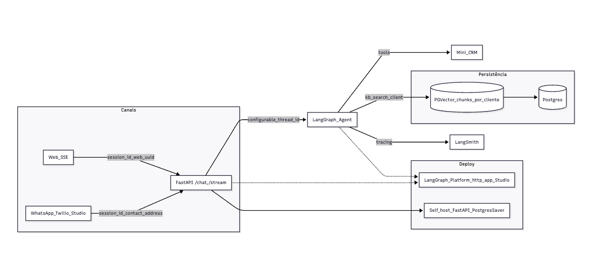

# Agente CRM com Orquestração de Multi-Intents (LangGraph)

Um agente de IA pronto para produção que orquestra múltiplas intenções em um único turno, executa operações de CRM e produz respostas naturais e unificadas.

Antes de explorar, execute `python -m pip install -r requirements.txt` para garantir que as dependências estejam instaladas.

## Visão Técnica e Stack
- Python 3.11+
- LangGraph e LangChain (versões pinadas em `requirements.txt`: `langgraph==0.6.7`, `langchain==0.3.27`).
- OpenAI para LLMs.
- Postgres/Supabase para dados do Mini‑CRM (schema e migrações incluídos).
- LangGraph Studio para depuração/execução.

## Arquitetura — Orquestração de Multi-Intents com Resposta Única

Principais ideias e componentes
- Planner LLM‑first (JSON): extrai todas as ações do turno em `{"actions": [{intent, slots: ["{...}"]}, ...]}` (PlanAction). Parsing robusto (aceita “quase‑JSON”).
- Fila de execução: `prepare_plan` normaliza e deduplica ações em `context.pending_actions`; `update_context` replaneja no máximo 1× por turno.
- Execução das ações:
  - Leads/Propostas: subgrafos ReAct — `leads_agent`, `proposals_agent` (tools + model com raciocínio médio para propostas).
  - Notas/Tarefas: nós dedicados — `handle_notes`, `handle_tasks` (chamam tools diretamente).
- Resposta única (finalizer): segmentos breves são empilhados em `context.ai_responses` e `respond_final` sintetiza uma resposta concisa via LLM.
- Resolução de lead: aceita referência textual (nome/email/telefone) e preserva quando não há `lead_id`; tools resolvem no DB. Quando possível, injeta o `lead_id` nos slots e nas pendências.
- Datas em tarefas: converte “hoje/amanhã” em ISO real; ignora placeholders inválidos.

Organização do código
- `app/agent/tools.py` — ferramentas do Mini‑CRM (nomes em inglês)
- `app/agent/prompt.py` — prompts (planner/finalizer/ReAct)
- `app/agent/helpers.py` — utilitários puros
- `app/agent/workflow.py` — grafo (nós comentados; edges e compilação)

Ferramentas disponíveis
- Leads: `create_lead`, `get_lead`, `search_leads`, `list_leads`, `update_lead`, `resolve_lead`
- Notas: `add_note_to_lead`, `list_notes`
- Tarefas: `create_task`, `complete_task`, `list_tasks`
- Propostas: `draft_proposal`, `add_proposal_item`, `calculate_proposal_totals`, `list_proposals`, `update_proposal_body`, `export_proposal`
- Lookup: `list_lead_status`, `respond_message`

## Diagrama da Arquitetura

## Como rodar (rápido)
- Pré‑requisitos
  - Python 3.11+
  - `OPENAI_API_KEY` no `.env` (use `cp .env.example .env` como base)
  - **Recomendado**: `LANGSMITH_API_KEY` no `.env` para observabilidade e debugging (obtenha em [smith.langchain.com](https://smith.langchain.com))
- Instalação
  - macOS/Linux: `python -m venv .venv && source .venv/bin/activate && python -m pip install -r requirements.txt`
  - Windows (PowerShell): `python -m venv .venv ; .\.venv\Scripts\Activate.ps1 ; python -m pip install -r requirements.txt`

### Banco de Dados
- Configure `DB_USER`, `DB_PASSWORD`, `DB_HOST`, `DB_PORT`, `DB_NAME` no `.env`.
- Inicialize o schema/seed do CRM: `make db_init`.

## Comandos (Makefile)
- `make help` — lista os comandos disponíveis
- `make db_list` — lista os arquivos `.sql` em `sql/`
- `make db_init` — aplica 00_drop + 01_schema + 02_seed
- `make db_apply` — aplica todos os `.sql` em `sql/`
- `make db_seed` — reaplica apenas o seed de status
- `make db_truncate` — trunca tabelas do Mini‑CRM (com confirmação)
- `make db_truncate_yes` — trunca tabelas do Mini‑CRM (sem confirmação)
- `make test_tools` — testes das ferramentas (DB)
- `make test_tools_v` — testes das ferramentas com prints (pytest -s)
- `make test_quick` — teste rápido de multi‑intents (sem LLM/DB)
- `make test_multi` — apenas os testes marcados como @slow (LLM + DB)
- `make test_fast` — somente testes não marcados como @slow
- `make test_pytest` — suíte completa pytest

## Executando o Agente no LangGraph Studio
- Instale o CLI do Studio: `pip install langgraph-cli`.
- No diretório `langgraph-crm-agent`, execute: `langgraph dev` ou `langgraph dev --allow-blocking` no Windows.
- Selecione o grafo `workflow` e converse com o agente. Exemplos:
  - “Cadastre o Lennon; adicione a nota follow‑up; crie tarefa para amanhã; rascunhe a proposta ACME.”
  - “Rascunhe uma proposta de Onboarding para o Lennon.” → “Adicione 2 unidades de Consultoria por R$ 5000 cada.” → “Recalcule os totais.”
- Acompanhe em “Messages” as `ToolMessage` e, em “State”, `context.pending_actions`, `context.ai_responses` e `lead_atual`.

## Testes automatizados (pytest)
- Pré‑requisito: DB configurado e `make db_init` aplicado para testes que usam DB.
- Rodar ferramentas (DB): `make test_tools` (ou `make test_tools_v` para prints)
- Rodar multi‑intents (LLM + DB): `make test_multi`
- Rodar tudo: `make test_pytest`

Por que usamos `.invoke({...})` nas tools?
- As funções decoradas com `@tool` viram `StructuredTool`. A forma recomendada de chamá‑las é `tool.invoke({"arg": valor})`.
- Quando o banco retorna UUID (objeto), converta com `str(uuid)` ao passar para `.invoke`.

## Observações e Boas Práticas
- **Resposta Única**: a resposta final é natural e concisa, gerada apenas a partir das ações realmente executadas (`context.ai_responses`).
- **Deduplicação**: o replanejamento não reinsere ações já executadas; pendências são limpas ao final do turno.
- **Resolução de Lead**: referências textuais são preservadas quando não há `lead_id`; as ferramentas resolvem identidades no banco de dados.
- **Manipulação de Datas**: datas relativas como "hoje/amanhã" são convertidas para formato ISO; placeholders inválidos são ignorados.
